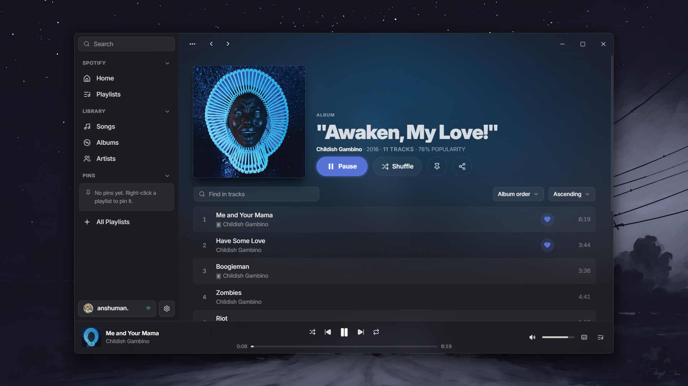
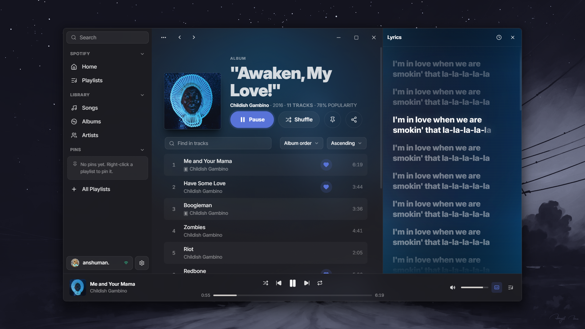
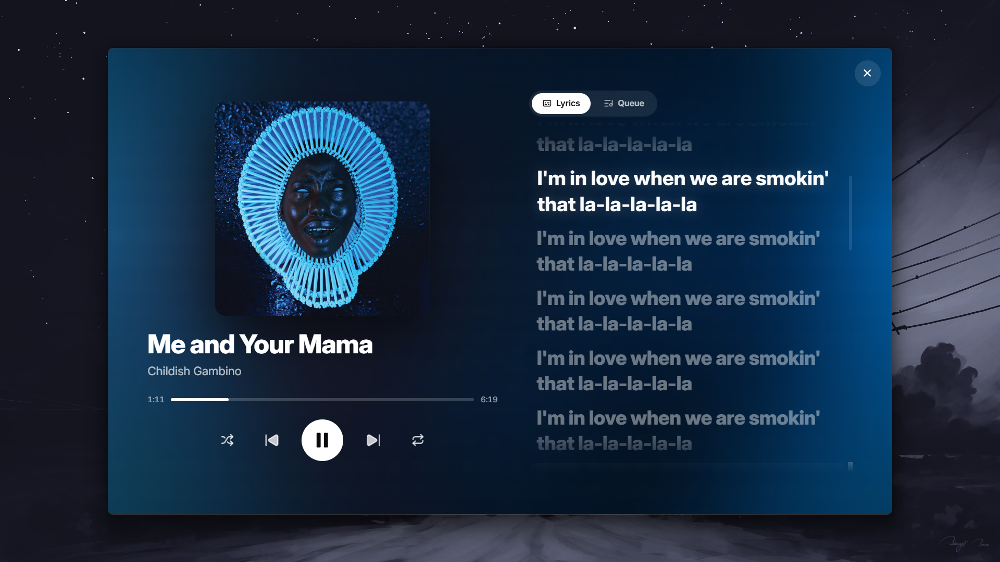
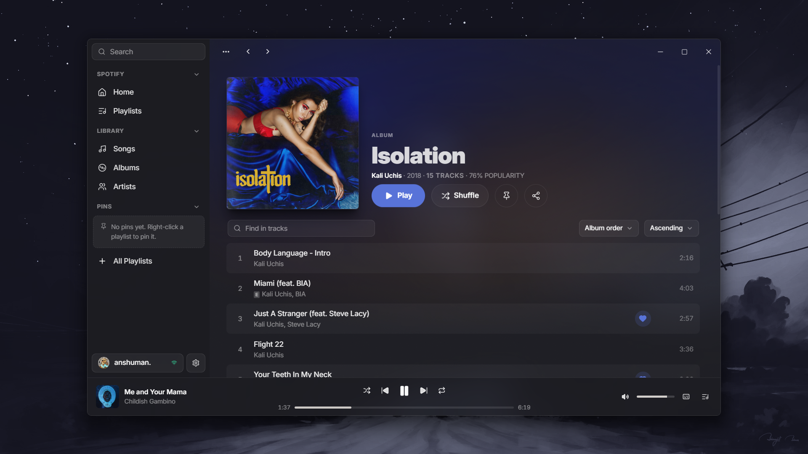

# Musique: The blazing-fast Spotify desktop client

> **⚠️ Unofficial.** Not affiliated with, endorsed by, or connected to Spotify.

> Uses the reverse-engineered librespot protocol, which is against Spotify's
> Terms of Service. Provided as-is for educational purposes. Use at your own risk.

> **Requires a Spotify Premium account** for playback.

<!-- TODO replace with a  hero screenshot -->
<!--  -->

## Screenshots

## Features

- **Full playback** - stream audio directly via a patched librespot core (Spotify Premium required)
- **Synced Lyrics** - Line-by-line and word-by-word lyrics from LRCLIB, with romanization for Japanese and Chinese.
- **Share links** - Cross-platform song link sharing via odesli (example: song.link, album.link)
- **Library Sync + offline cache** - playlists, saved tracks, new releases (reads are cache-first for offline compatability)
- **Native window chrome/tint** - Windows 11 Mica/Acrylic, and MacOS vibrancy.
- **Dynamic Accent Colors** - Based on the album/playlist, your wallpaper, or your system accent color.
- **Customizable Transparency** 
- **OS media controls integration** 

### ⚠️ In progress:

- **Discord Rich Presence** - Discord rich presence compatabilty, to show what you're listening to.
- **LastFM integration** - Auto scrobbling, and statistics in-app.

## Tech Stack

### Frontend:
- **React 19**
- **Typescript**
- **Vite 7**
- **Tailwind v4**
- **Zustand**
- **Tanstack Query**
- **React Router**

### Backend:

- **Rust**
- **Tauri 2**
- **sqlx + SQLite**
- **keyring (OS keychain)**
- **reqwest**
- **Vendored librespot**

## Prerequisites

- **A Spotify Premium** account (required for playback)
- A Spotify app in the [Developer Dashboard](https://developer.spotify.com/dashboard) , with valid `client_id` and `client_secret`
- [Rust](https://rustup.rs/) toolchain
- Node + [pnpm](https://pnpm.io/) v11
- Platform build deps (see below)

### Security
Tokens and the client secret live only in the OS keyring (Windows Credential
Manager / MacOS Keychain / Secret Service)

 Nothing sensitive crosses the IPC
boundary to the frontend, and no credentials are committed to the repo

### Acknowledgements

- librespot: the open Spotify protocol client this is built on (MIT)
- LRCLIB: synced lyrics
- Cider: the inspiration

### License

MIT: see the license file. Vendored librespot retains its own MIT
license under src-tauri/vendor/

### Credits:
- [Anirudh](https://github.com/techwithanirudh) - macOS testing

- [Laura](https://github.com/lauragarden) - macOS testing

- [Luiggi](
https://github.com/luiggineedsabreak) - Linux and Windows testing

- [spacefren](https://github.com/spacefren) - Linux testing
