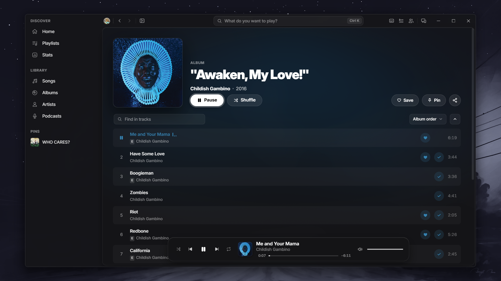
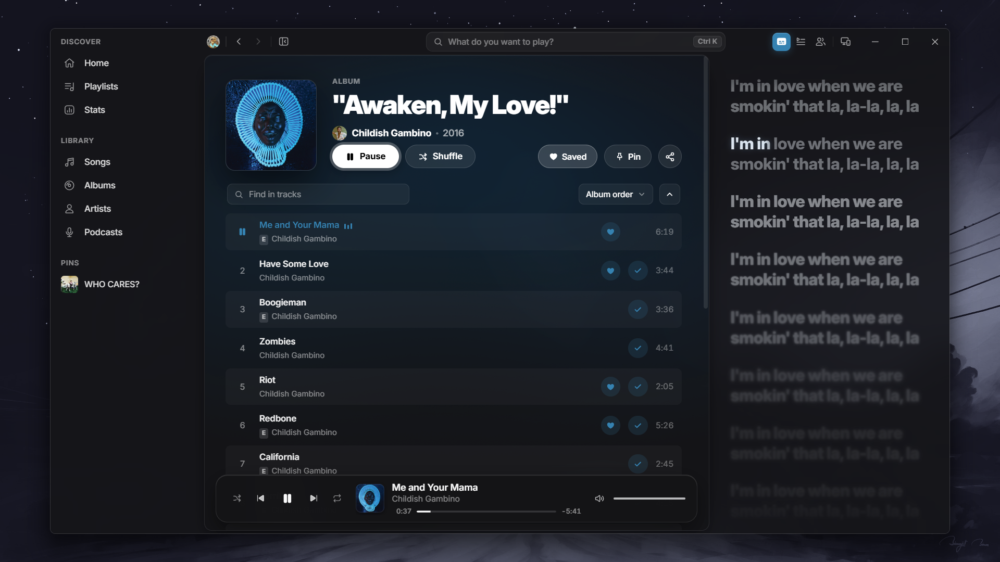
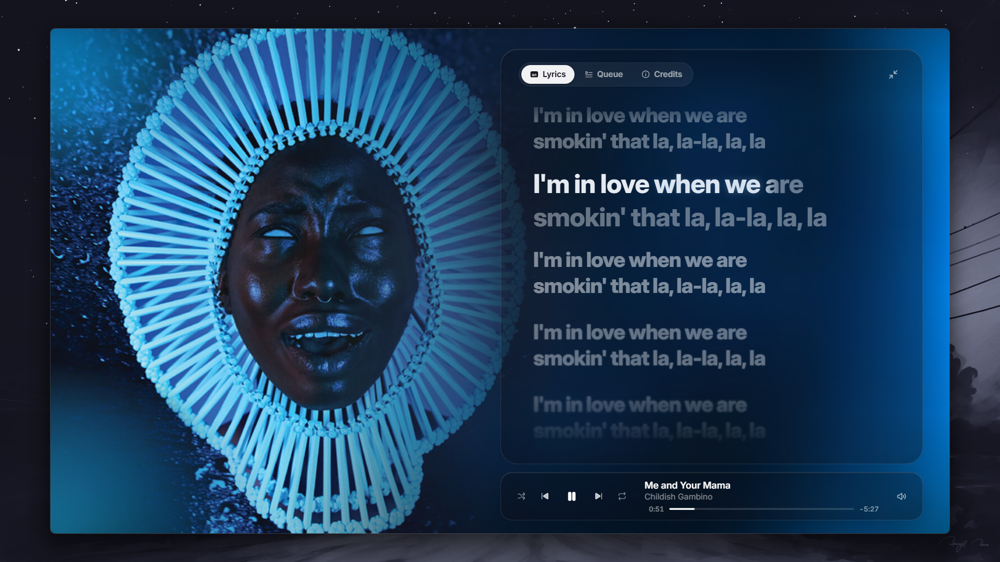
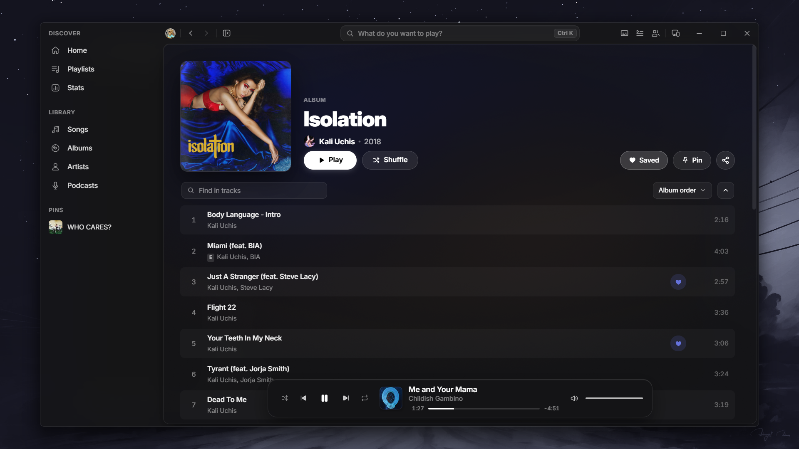

# Musique: the blazing-fast Spotify desktop client


> **Unofficial.** Not affiliated with, endorsed by, or connected to Spotify.
> Uses the reverse-engineered librespot protocol, which is against Spotify's
> Terms of Service. Provided as-is for educational purposes. Use at your own risk.

## Screenshots

<div align="center">
  
  
</div>
<div align="center">
  
  
</div>

## Features

- **Full playback** via a patched librespot core (Spotify Premium). Free accounts play through YouTube Music instead, with metadata and lyrics still coming from Spotify.
- **Synced lyrics** from LRCLIB, Apple Music, Musixmatch, NetEase, QQ Music, Kugou, AMLL, BetterLyrics and Spotify. Line and word-by-word timing, with romanization for Japanese and Chinese.
- **Podcasts**, including playback speed control.
- **Spotify Connect and Jam.** Shows up as a Connect device in the official apps.
- **Share links** for any platform via Odesli (song.link, album.link).
- **Library sync + offline cache.** Playlists, saved tracks and new releases load from a local SQLite cache first.
- **Native window chrome.** Mica/Acrylic on Windows 11, vibrancy on macOS.
- **Dynamic accent colors** from the album/playlist, your wallpaper, or your system accent.
- **Customizable transparency**
- **Discord Rich Presence** and **Last.fm scrobbling**
- **OS media controls**
- **Auto-updates** from GitHub releases

## Install

Grab the latest build from [Releases](https://github.com/CodingBoyBlah/Musique/releases/latest).

## Tech stack

**Frontend:** React 19, TypeScript, Vite 7, Tailwind v4, Zustand, TanStack Query, React Router

**Backend:** Rust, Tauri 2, sqlx + SQLite, keyring (OS keychain), reqwest, vendored librespot

## Building from source

You need the [Rust](https://rustup.rs/) toolchain, Node, [pnpm](https://pnpm.io/) v11, and
[Tauri's platform deps](https://v2.tauri.app/start/prerequisites/). On Linux also install `libasound2-dev`.

```bash
pnpm install
pnpm tauri dev
```

Login works out of the box. If you'd rather use your own Spotify app, copy
`.env.example` to `.env` and fill it in, or set it in Settings.

## Security

Tokens and the client secret live only in the OS keyring (Windows Credential
Manager / macOS Keychain / Secret Service). Nothing sensitive crosses the IPC
boundary to the frontend, and no credentials are committed to the repo.

## Acknowledgements

- [librespot](https://github.com/librespot-org/librespot): the open Spotify protocol client this is built on (MIT)
- [LRCLIB](https://lrclib.net/): synced lyrics
- [Cider](https://cider.sh/): the inspiration

## Credits

- [Anirudh](https://github.com/techwithanirudh) - macOS testing
- [Laura](https://github.com/lauragarden) - macOS testing
- [Luiggi](https://github.com/luiggineedsabreak) - Linux and Windows testing
- [spacefren](https://github.com/spacefren) - Linux testing

## License

MIT, see [LICENSE](LICENSE). Vendored librespot keeps its own MIT license under `src-tauri/vendor/`.
